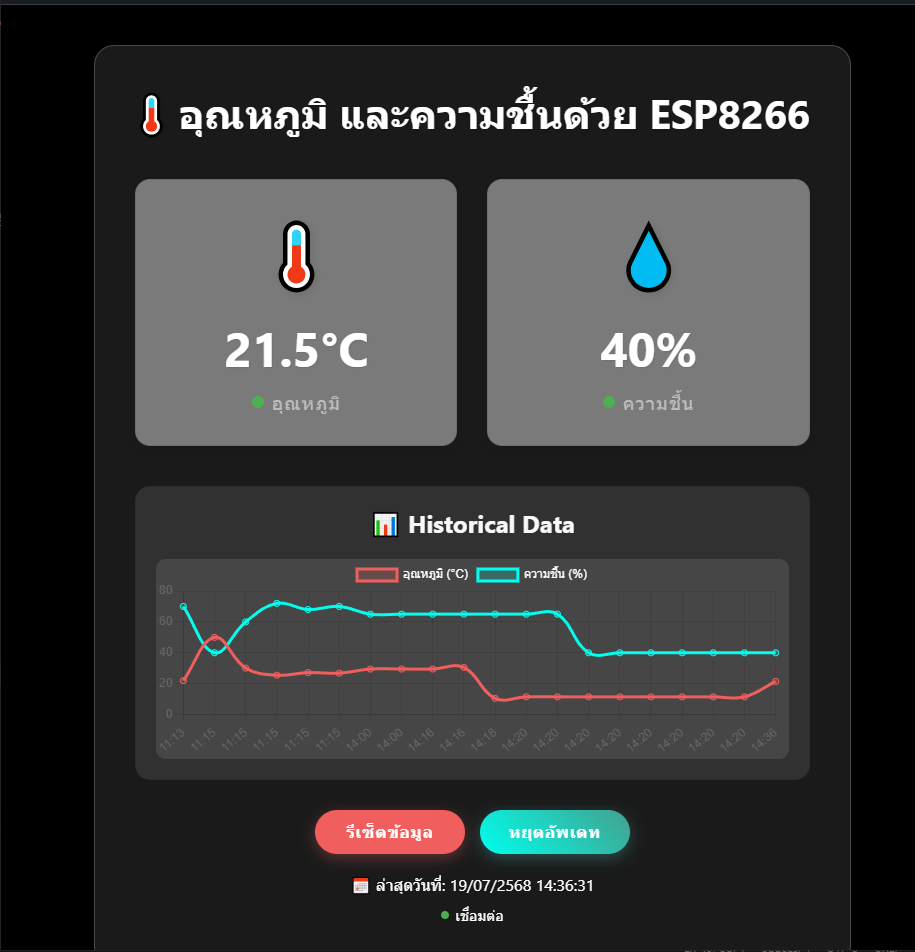

# temperature-and-humidity-as-well-ESP8266
📦my-project/
┣ 📂vue_frontend/                   
┃ ┣ 📂dist/                         
┃ ┣ 📂node_modules/               
┃ ┣ 📂public/                     
┃ ┣ 📂src/                         
┃ ┃ ┣ 📂components/               
┃ ┃ ┃ ┣ 📄HistoricalChart.vue    
┃ ┃ ┃ ┗ 📄Server.vue             
┃ ┃ ┣ 📄App.vue                 
┃ ┃ ┗ 📄main.js                  
┃ ┣ 📄package.json              
┃ ┗ 📄vite.config.js / vue.config.js
┣ 📂node_backend/                 
┃ ┣ 📂controllers/                
┃ ┣ 📂models/                     
┃ ┣ 📂middlewares/               
┃ ┣ 📂config/                   
┃ ┣ 📄server.js                  
┃ ┗ 📄package.json                
┣ 📄README.md                     
┗ 📄.gitignore                    

# Clone โปรเจกต์
git clone https://github.com/pammytv2/temperature-and-humidity-as-well-ESP8266.git

# เข้าโฟลเดอร์โปรเจกต์
cd repo-name

# ติดตั้ง dependency
npm install

# รันแอป
npm run dev

